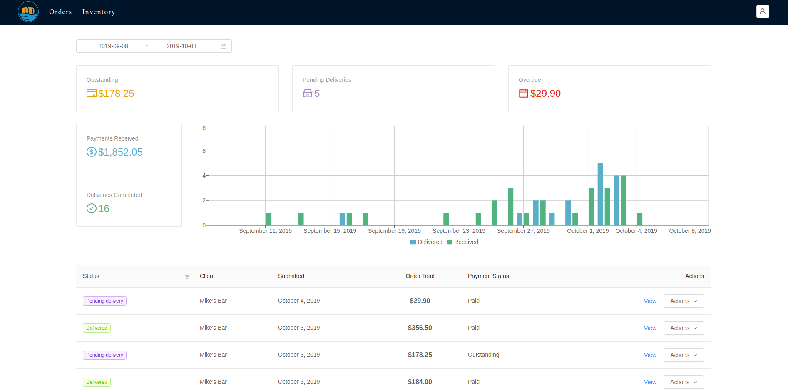
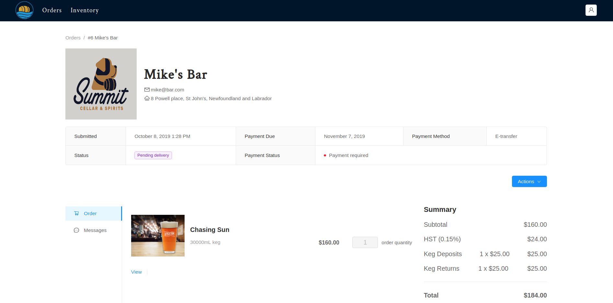
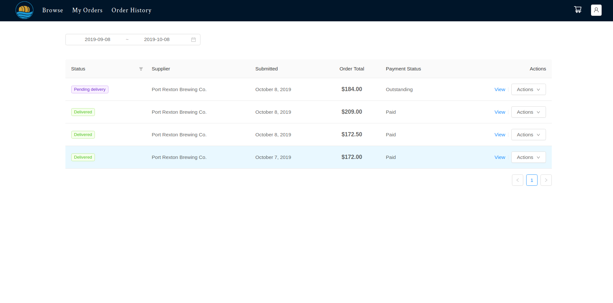

# bivver-backend
The backend for the Bivver brewery management application

Bivver is a full featured brewery management application for both suppliers and buyers to manage orders, deliveries and payments.

The backend uses Django, Django Rest Framework and MySQL.

